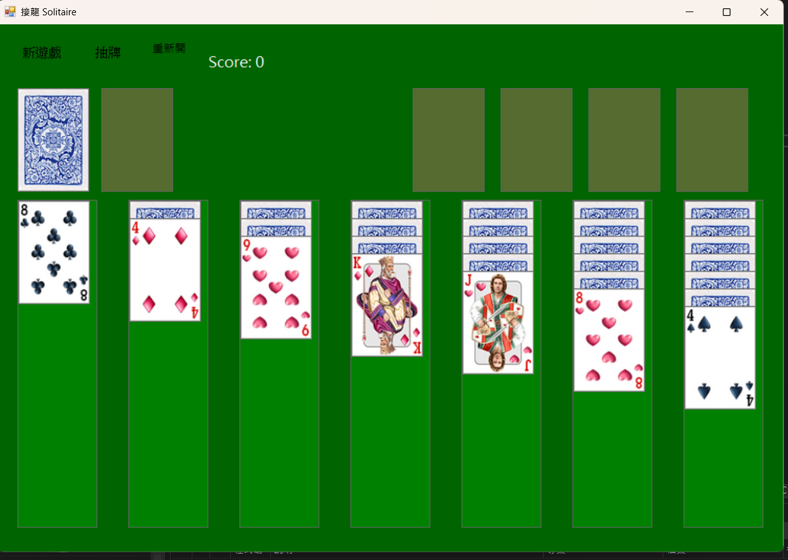

# 接龍遊戲專題報告

## 一、遊戲使用說明

本專題為 Windows Forms 製作之接龍遊戲，玩家需依照撲克牌規則完成所有牌組。

### 遊戲玩法

1. 玩家可以使用滑鼠點擊並移動卡牌。  
2. 卡牌必須遵守以下規則：  
   - 紅黑交錯  
   - 數字遞減  
3. 空白欄位只能放入 K。  
4. 完成區必須同花色且由 A 開始依序放置。  
5. 當所有卡牌完成排列後即獲勝。  

### 功能特色

- GUI 圖形介面
- 音效提示功能
- 勝利提示
- 錯誤操作提醒
- 自動判斷規則是否合法

---

# 二、問題排除與學習心得

## 開發過程遇到的問題

### 1. 卡牌拖曳問題

一開始卡牌會跟著滑鼠移動不正常，造成牌的位置錯亂。

#### 解決方法

重新設計滑鼠事件，改成使用固定座標與合法移動判斷，避免卡牌持續跟隨滑鼠。

---

### 2. 音效播放失敗

部分音效檔名稱與程式內名稱不一致，導致無法播放。

#### 解決方法

統一 `.wav` 檔名並重新檢查路徑設定。

---

### 3. GUI 排版問題

卡牌重疊與排列位置不整齊。

#### 解決方法

重新調整 `PictureBox` 座標與間距，並統一卡牌大小。

---

## 學習心得

透過這次專題，我學習到：

- Windows Forms GUI 設計
- PictureBox 與事件控制
- 滑鼠事件（MouseDown、MouseMove、MouseUp）
- 遊戲規則判斷
- 除錯技巧
- GitHub 上傳與版本管理

其中最困難的是拖曳功能與規則判斷，但完成後對事件控制與 GUI 開發更加熟悉。

---

# 三、資料來源

- Microsoft Windows Forms 官方文件  
  https://learn.microsoft.com/dotnet/desktop/winforms/

- 撲克牌規則參考  
  https://zh.wikipedia.org/zh-tw/%E6%8E%A5%E9%BE%8D

- 音效素材來源 TTSMAKER  
  https://ttsmaker.com/zh-hk
